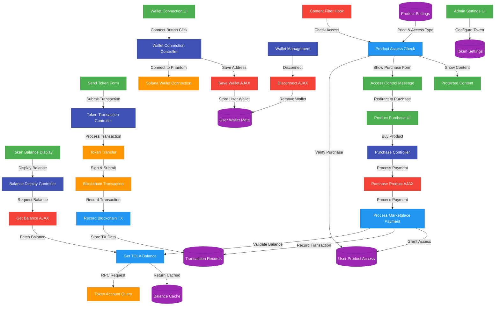

# TOLA Token Integration Architecture

This document provides a comprehensive overview of the TOLA token integration architecture, including UI/UX components, data flow, and system interactions.

## System Architecture Diagram



## Color Legend

- **Green** - User Interface Components: Visual elements users interact with
- **Blue** - Server-side Processes: PHP functions and data handling
- **Orange** - Blockchain Interactions: Solana network interactions
- **Purple** - Database Entities: Data persistence
- **Red** - WordPress Hooks: Filters and actions
- **Indigo** - Core Controllers: JavaScript business logic

## Component Descriptions

### User Interface Components

| Component | File Location | Description |
|-----------|---------------|-------------|
| Wallet Connection UI | `public/js/vortex-tola.js` | Buttons to connect/disconnect Phantom wallet |
| Token Balance Display | `public/js/vortex-tola.js` | Shows user's current TOLA balance |
| Send Token Form | `vortex-tola.js` + Shortcode | Form for sending TOLA to other users |
| Product Purchase UI | `check_content_access()` output | Interface for buying products with TOLA |
| Access Control Message | `get_purchase_required_message()` | Prompts for login or purchase |

### JavaScript Controllers

| Controller | Function | Description |
|------------|----------|-------------|
| Wallet Connection | `connectWallet()`, `disconnectWallet()` | Manages Phantom wallet connections |
| Balance Display | `updateTolaBalance()` | Retrieves and displays token balance |
| Token Transaction | `sendTolaTokens()` | Handles token transfer process |
| Purchase Controller | `purchaseProduct()` | Processes product purchases |

### AJAX Handlers

| Handler | PHP Function | Description |
|---------|-------------|-------------|
| Save Wallet | *Not included in current implementation* | Stores wallet address to user meta |
| Get Balance | `ajax_get_tola_balance()` | Retrieves user's token balance |
| Disconnect | `ajax_disconnect_wallet()` | Removes wallet association |
| Purchase Product | `ajax_purchase_product()` | Processes product purchase with TOLA |

### Server-side Processes

| Process | Function | Description |
|---------|----------|-------------|
| Get TOLA Balance | `get_tola_balance()` | Fetches token balance from Solana |
| Process Payment | `process_marketplace_payment()` | Handles product purchases |
| Record Transaction | `record_transaction()` | Logs transaction details |
| Access Check | `check_product_access()` | Verifies user's access rights |

### Database Entities

| Entity | WordPress Table/Meta | Description |
|--------|---------------------|-------------|
| User Wallet Meta | `user_meta` | Stores user's wallet address |
| Balance Cache | Transients | Caches token balances |
| Transaction Records | `vortex_transactions` | Stores transaction history |
| User Product Access | `user_meta` | Records purchased products |
| Product Settings | `post_meta` | Stores pricing and access settings |

### WordPress Hooks

| Hook | Function | Description |
|------|----------|-------------|
| Content Filter | `check_content_access()` | Restricts content based on purchases |
| Admin Init | `register_admin_settings()` | Registers settings fields |
| Meta Boxes | `add_product_meta_boxes()` | Adds TOLA pricing options |
| Save Post | `save_tola_pricing_meta_box()` | Stores product pricing |

## UI/UX Flow Sequences

### 1. Wallet Connection Flow

1. User clicks "Connect Wallet" button
2. JavaScript prompts Phantom wallet connection
3. Wallet returns address upon approval
4. Address is saved to user meta
5. UI updates to show connected state
6. Balance is fetched and displayed

### 2. Product Purchase Flow

1. User accesses restricted content
2. System checks for purchase record
3. If not purchased, purchase form is displayed
4. User clicks "Purchase" button
5. System verifies TOLA balance
6. Transaction is recorded and access granted
7. User redirected to now-accessible content

### 3. Token Transfer Flow

1. User enters recipient address and amount
2. User submits send form
3. JavaScript constructs Solana transaction
4. User approves transaction in Phantom
5. Transaction is submitted to blockchain
6. System records transaction in database
7. UI updates with success message and new balance

## Implementation Guidelines

### Maintaining UI/UX Consistency

1. **Color Scheme**: Use consistent colors for TOLA-related UI elements:
   - Primary actions: `#4CAF50` (green)
   - Balance displays: `#2196F3` (blue)
   - Warnings/errors: `#F44336` (red)

2. **Button Styles**: Maintain consistent button styling:
   ```css
   .vortex-tola-button {
     background-color: #4CAF50;
     color: white;
     padding: 10px 15px;
     border-radius: 4px;
     border: none;
     font-weight: 600;
   }
   
   .vortex-tola-button:hover {
     background-color: #388E3C;
   }
   ```

3. **Form Layout**: Use consistent form layout with clear labels and error states.

4. **Loading States**: Always show loading indicators during blockchain operations.

### Error Handling Protocol

1. Wallet connection errors should prompt clear reinstallation instructions
2. Insufficient balance errors should suggest where to obtain more tokens
3. Transaction failures should explain reason and suggest retry
4. All errors should be logged server-side for debugging

### Integration Testing Checklist

- [ ] Wallet connects successfully
- [ ] Balance displays correctly
- [ ] Token transfers complete properly
- [ ] Purchase flow completes end-to-end
- [ ] Access control functions correctly
- [ ] Subscriptions expire at correct time
- [ ] Admin settings save and load properly

## Extending the Architecture

When adding new features to the TOLA integration, follow these guidelines:

1. Add new UI components to appropriate existing containers
2. Create server endpoints using the same error handling pattern
3. Document all new blockchain interactions
4. Update this diagram when architecture changes

## Mobile Responsiveness

Ensure all UI components function on mobile devices:

1. Touch-friendly button sizes (minimum 44x44px)
2. Responsive layouts that reflow on smaller screens
3. Consider touch-specific interactions for wallet connections

## Security Considerations

1. Always validate user input server-side
2. Never store private keys or sensitive wallet data
3. Use nonces for all AJAX operations
4. Rate-limit blockchain operations
5. Validate transactions server-side even after client-side validation 